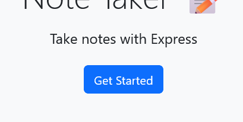
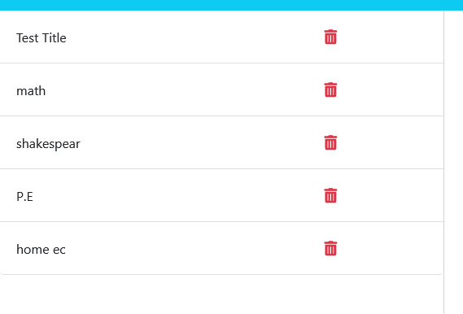
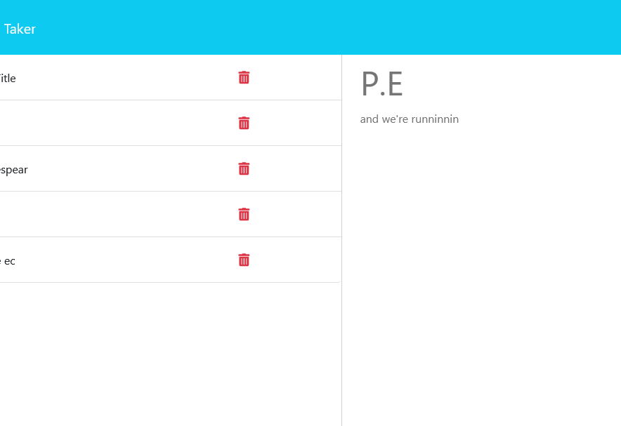
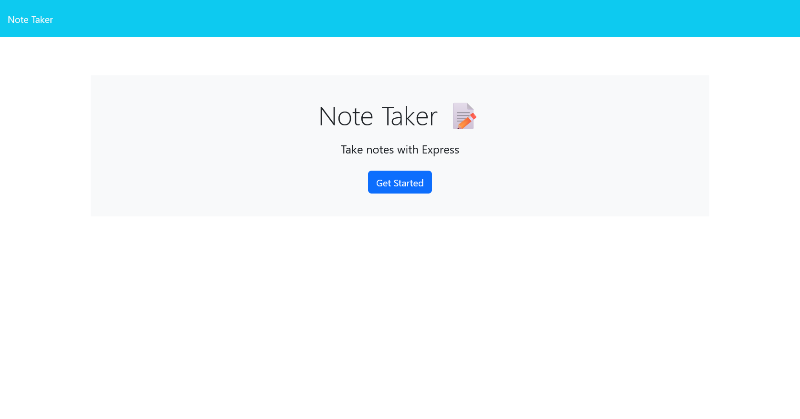
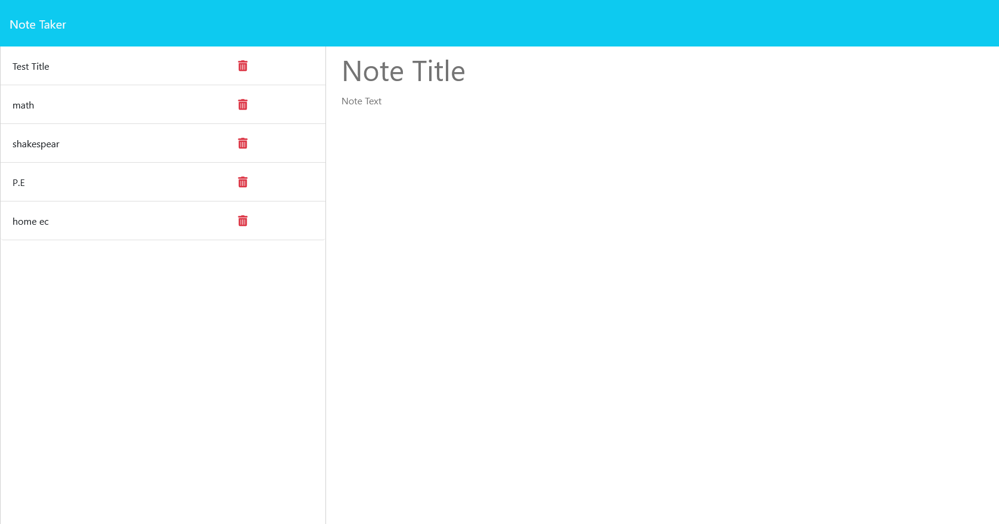

# Note-Taker
As a student the struggle to make and organize notes takes up a lot of time. With this application a user can write and save their notes and have them displayed in a list. The notes can also be viewed later by selecting them. This makes note taking and keeping easy.

## Link
[Note-Taker](https://calm-depths-62593-019430d66823.herokuapp.com/)

## Table of Contents

- [Usage](#usage)
- [Screenshots](#screenshots)

## Usage 

On the home screen click the get started button.\
\
Then the user can type the title and text of their note in the text boxes.\
\
If the user wants to view a note then they can click it on the list \
\
and it will display on the right.\
\
From the old note if a user wants to make a new note then they can click the new note button.\

## Screenshots

